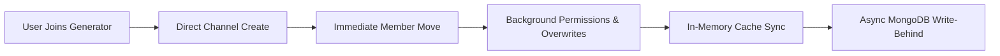

<div align="center">

  

  <p align="center">
    <a href="https://discord.js.org"></a>
    <a href="https://www.typescriptlang.org/"></a>
    <a href="https://nodejs.org"></a>
    <a href="https://www.mongodb.com/"></a>
    <a href="LICENSE"></a>
  </p>

  <p align="center">
    <b>An ultra-fast, production-grade temporary voice channel management bot built with native Discord Components V2, in-memory caching, and sub-350ms channel creation latency.</b>
  </p>

  <p align="center">
    <a href="#-key-highlights">Highlights</a> •
    <a href="#-architecture--performance">Architecture</a> •
    <a href="#-installation--setup">Setup</a> •
    <a href="#-commands--controls">Commands</a> •
    <a href="#-license">License</a>
  </p>

  
</div>

<br/>

## ⚡ Key Highlights

<table>
  <tr>
    <td width="50%">
      <h3 align="left"> Sub-350ms Creation Latency</h3>
      <p>Direct room allocation with immediate member relocation and non-blocking parallel permission setup.</p>
    </td>
    <td width="50%">
      <h3 align="left"> Discord Components V2 UI</h3>
      <p>Native dynamic containers, separators, and media galleries matching server theme palettes.</p>
    </td>
  </tr>
  <tr>
    <td width="50%">
      <h3 align="left"> Automated Anti-Abuse Engine</h3>
      <p>Real-time detection and disconnection of spam joiners with inline permit/deny moderation buttons.</p>
    </td>
    <td width="50%">
      <h3 align="left"> Smart Ownership Lifecycle</h3>
      <p>Automatic room claim prompts upon owner departure with dynamic message updates on owner return or claim.</p>
    </td>
  </tr>
  <tr>
    <td width="50%">
      <h3 align="left"> In-Memory Store & Sync</h3>
      <p>Zero database stalls during interactions via memory-backed stores with async write-behind MongoDB persistence.</p>
    </td>
    <td width="50%">
      <h3 align="left"> Dynamic Developer Emojis</h3>
      <p>Startup synchronization with application emojis on the Discord Developer Portal with fallback support.</p>
    </td>
  </tr>
</table>

<br/>

##  Architecture & Performance



- **Memory Footprint**: ~20MB RAM under PM2 execution.
- **CPU Idle**: < 0.1% CPU consumption.
- **Interaction Response**: Instant ephemeral interaction updates.

<br/>

##  Installation & Setup

### 1. Clone Repository
```bash
git clone https://github.com/YOUR_USERNAME/onetap-voice.git
cd onetap-voice
```

### 2. Install Dependencies
```bash
npm install
```

### 3. Configure Environment
Create your `.env` configuration:
```bash
cp .env.example .env
```

```ini
DISCORD_TOKEN=your_bot_token_here
CLIENT_ID=your_client_id_here
MONGODB_URI=mongodb://localhost:27017/onetap_voice
DEFAULT_PREFIX=.v
AUTO_LOAD_EMOJIS=true
```

### 4. Build & Start
```bash
# Build TypeScript
npm run build

# Start Production Server
npm start
```

<br/>

## 🎮 Commands & Controls

<details open>
<summary><b>Voice Channel Management</b></summary>
<br/>

| Command | Syntax | Description |
| :--- | :--- | :--- |
| **Setup** | `.v setup` | Launch interactive setup for generators, categories, themes & panels |
| **Panel** | `.v panel` | Send the voice channel control panel to your room |
| **Need Help** | `.v needhelp` | Relocate to the configured Need Help voice room (15s cooldown) |
| **Lock / Unlock** | `.v lock` / `.v unlock` | Lock or unlock your room to prevent new connections |
| **Hide / Unhide** | `.v hide` / `.v unhide` | Toggle room visibility for unauthorized users |
| **Rename** | `.v name <name>` | Change voice room name |
| **Limit** | `.v limit <0-99>` | Adjust user connection limit |
| **Permit** | `.v permit <@user>` | Allow specific users or roles into your room |
| **Reject** | `.v reject <@user>` | Disconnect and ban users from joining your room |
| **Claim** | `.v claim` | Claim ownership of an abandoned voice room |
| **Info** | `.v info` | View detailed real-time channel statistics and duration |
| **Anti-Abuse** | `.v ab` | Toggle the anti-abuse shield for your room |

</details>

<br/>

##  Discord Privileged Intents

Make sure to enable all Privileged Gateway Intents in the **[Discord Developer Portal](https://discord.com/developers/applications)**:
- `PRESENCE INTENT`
- `SERVER MEMBERS INTENT`
- `MESSAGE CONTENT INTENT`

<br/>

##  License

Distributed under the **MIT License**. See `LICENSE` for more information.

<div align="center">
  
</div>
